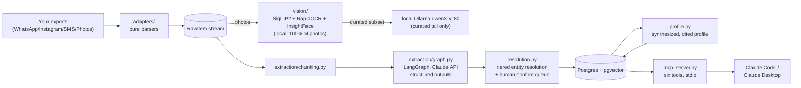

# locket

A privacy-first personal context engine: it ingests your own photo and
messaging exports (WhatsApp, Instagram DMs, SMS/MMS backups, Google Photos
Takeout), extracts typed, provenance-cited facts about your life with an
LLM pipeline, resolves the people and places those facts mention into
stable entities, stores everything in Postgres+pgvector, and serves the
resulting profile to other tools over MCP (Model Context Protocol) — so you
can ask Claude Code or Claude Desktop things like "when did I last see
Sarah?" and get an answer that cites the exact message it came from.

## Architecture



Full stage-by-stage breakdown, module boundaries, and the dual-corpus design:
**[`docs/architecture.md`](docs/architecture.md)**. 90-second walkthrough with
scripted questions and MCP registration commands:
**[`docs/demo.md`](docs/demo.md)**.

## Quickstart (against the committed synthetic demo corpus)

```bash
docker compose up -d db          # Postgres + pgvector
uv sync                          # hand-edit pyproject.toml + `uv sync` to add deps — no `uv add`

uv run python -m locket.cli ingest demo_corpus/whatsapp/team.txt
uv run python -m locket.cli ingest demo_corpus/sms/backup.xml
uv run python -m locket.cli ingest demo_corpus/photos

# No ANTHROPIC_API_KEY needed — with no key set, extraction/resolution/
# profile all run against a local Ollama model by default (see "Running
# fully local" below). --skip-vision bypasses the local vision pre-pass +
# Ollama vision-LLM tail (~135s/image measured — see evals/BASELINE.md —
# worth skipping for a quick pass).
uv run python -m locket.cli pipeline run --skip-vision --corpus-dir demo_corpus

uv run python -m locket.cli profile build
claude mcp add --scope user locket -- uv run --directory "$(pwd)" python -m locket.mcp_server
```

Full command reference (every subcommand: `ingest`, `pipeline run`,
`resolve`, `label-faces`, `eval extraction|rag`, `profile build`, `serve`)
and the exact Claude Desktop registration JSON block:
**[`docs/demo.md`](docs/demo.md)**.

To run against your own data instead of the demo corpus, set
`LOCKET_CORPUS_DIR` in a local `.env` (never inside this repo — see
`.env.example`) and point `ingest` / `pipeline run --corpus-dir` at it.

## Running fully local (no API key)

Every LLM call locket makes — extraction, entity resolution, profile
rendering, and the MCP server's `answer_question` — goes through one
backend-selection seam, `locket.llm.get_chat_model`. It picks between two
backends:

- **`anthropic`** (`ChatAnthropic`, real network calls to Claude, higher
  quality, costs money): used automatically when `ANTHROPIC_API_KEY` is set,
  or when you force it with `LOCKET_LLM_BACKEND=anthropic`.
- **`ollama`** (`ChatOllama`, a local Ollama server, free, no data leaves
  your machine): the default when no API key is present. `locket pipeline
  run` no longer refuses to run keylessly — it just uses this backend
  instead.

Requirements: an Ollama server running locally (`ollama serve`, or the
desktop app) with the text model pulled — `ollama pull gemma3:12b` (the
default, ~8GB) or set `LOCKET_LOCAL_MODEL=qwen2.5:3b-instruct` for a
smaller, already-common model. `OLLAMA_HOST` is respected if you want to
point at a different machine's Ollama (e.g. over Tailscale) instead of
`localhost:11434` — locket does not read or override it itself.

**Honest quality/speed tradeoff, measured on this project's dev machine
(CPU-only Ollama):** the local backend is markedly slower and somewhat
lower-quality than the Claude API backend. `gemma3:12b` took roughly 10-130s
per extraction window (vs. sub-second-to-a-few-seconds for `claude-haiku-4-5`)
and produced fewer, though more information-dense, facts per window than a
smaller local model (`qwen2.5:3b-instruct`, ~10x faster but noisier — see
`src/locket/llm.py`'s module docstring for the side-by-side). Vision
(`qwen3-vl:8b`) already ran local-only regardless of this setting, at its own
separately-measured ~135s/image. Full real pipeline-run numbers (fact
counts, wall time) for the local backend are in `evals/BASELINE.md`'s
"local backend (informal)" section — the official baseline stays the
Claude API run, pending a real key.

## Privacy posture

Stated plainly, not hand-waved:

- **Storage is fully local.** Postgres+pgvector runs in your own Docker
  container. Nothing about your facts, entities, or profile is sent
  anywhere except the specific API calls described below.
- **Text extraction uses the Claude API.** Message/photo-OCR text is sent to
  Anthropic under their no-training API terms to extract structured facts
  (`claude-haiku-4-5`, escalating to `claude-sonnet-5` on repeated
  validation failures) and to render profile prose and answer questions.
  This is a real network call to a third party — disclosed honestly, not
  claimed as "fully private."
- **Real photos are processed by local models only.** EXIF/GPS, SigLIP2
  zero-shot tagging, RapidOCR, and InsightFace face clustering all run
  locally on 100% of your photo library, for free. The one open-ended
  "describe this photo" step (the vision-LLM tail) runs against a small,
  curated subset using **local Ollama `qwen3-vl:8b`** — never a cloud vision
  model, for real photos.
- **Gemini's free tier is explicitly forbidden for real photos.** Google's
  free-tier terms grant Google the right to train on and have humans review
  submitted content — unacceptable for private photos of your life. Gemini
  is permitted only as an opt-in path for generating the *synthetic* demo
  corpus, where no privacy stakes exist (the faces are AI-generated, MIT-
  licensed SFHQ portraits, and every conversation is invented). A paid
  Claude-API fallback for real photos exists behind an explicit `--cloud-ok`
  flag if local Ollama is unavailable — still Anthropic's no-training terms,
  never Gemini free tier.
- **Your real exports never enter this repository.** They're read from
  `LOCKET_CORPUS_DIR`, an env var pointing outside the repo, declared in a
  local, gitignored `.env`. `.gitignore` also blocks `real_corpus/` and
  `*.local.*` (the pattern the real self-labeled eval gold set uses:
  `evals/gold/real_gold.local.yaml`). Everything under `demo_corpus/` in
  this repo is synthetic — five invented personas, generated conversations,
  and staged photos of AI-generated faces — used for every test, CI run,
  and the public demo. No real data of any kind ships in this repository.

## Eval results

locket ships two eval suites (`evals/extraction_eval.py`,
`evals/rag_eval.py`), both runnable via `locket eval extraction|rag --json`
and both gated in CI (`.github/workflows/eval.yml`, nightly + on-demand —
kept out of the free push/PR lint+test workflow since they cost real money
per run). Full methodology, every number's provenance, and the exact
commands to reproduce or extend each measurement: **`evals/BASELINE.md`**.

| Metric | Value | Status |
|---|---|---|
| Vision-LLM tail latency (`qwen3-vl:8b`, CPU-only, this machine) | **~135s/image mean** (range 86–205s, n=6) | Measured live, Task 13 |
| Entity-resolution similarity floor (`arctic-embed-s`) | Same-person variants 0.57–0.90 cosine; different-person 0.42–0.47 | Measured live, Task 14 |
| Extraction P/R/F1 vs. the 60-fact synthetic gold set | — | **Pending `ANTHROPIC_API_KEY`** — harness implemented + unit-tested, live run recorded as a ready-to-run command in `evals/BASELINE.md` |
| Ragas faithfulness / answer-relevancy / context-precision (25 questions) | — | **Pending `ANTHROPIC_API_KEY`** — same status; starting thresholds (0.85 / 0.80 / 0.70) are asserted directly once it runs |
| Real-corpus self-labeled gold set (100–200 facts, spec §4.1) | — | **Noah-gated** — needs his real exports + the API key, off-repo by design (`evals/gold/real_gold.local.yaml`, gitignored) |

No number above is invented — where a measurement is blocked on a
still-absent API key, the table says so plainly instead of filling in a
plausible-looking placeholder.

## License

MIT (`LICENSE`). Third-party model weights and assets carry their own,
narrower terms — see **`THIRD_PARTY_NOTICES.md`** before distributing or
monetizing anything built on this repo (notably: InsightFace's `buffalo_l`
face-analysis weights are non-commercial/research-personal use only, even
though the InsightFace code itself is MIT).

See `Claude/specs/2026-07-30-locket-design.md` (private planning vault, not
part of this repo) for the full design writeup.
